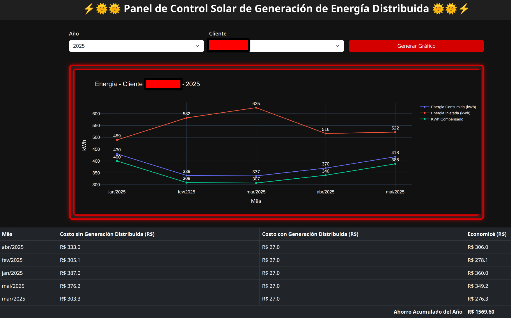

# ⚡🌞🌞 Panel de Control Solar de Generación de Energía Distribuida 🌞🌞⚡



Este proyecto es un dashboard web interactivo construido con **Flask** (Python) que permite visualizar y analizar datos de consumo, inyección y ahorro de energía para clientes de sistemas de generación de energía solar distribuida. Utiliza datos de archivos CSV para generar gráficos dinámicos y tablas de costos y ahorros.

## Visión General del Proyecto

El objetivo principal de este dashboard es proporcionar una herramienta intuitiva para que los usuarios puedan:
1.  **Seleccionar un año** para el análisis.
2.  **Seleccionar un cliente específico** dentro del año elegido.
3.  **Visualizar gráficos** de energía consumida, energía inyectada y kWh compensados a lo largo de los meses.
4.  **Analizar tablas** comparativas de costos de energía con y sin generación distribuida, además del ahorro generado.
5.  **Ver el total de ahorro acumulado** para el año seleccionado.

## Cómo Funciona

El proyecto se compone de tres partes principales:

1.  **Backend (Python - Flask):**
    * Gestiona las rutas de la aplicación web.
    * Lee los datos de archivos CSV (ubicados en el directorio `csv/`). Cada archivo CSV representa un año y contiene datos de múltiples clientes.
    * Funciones para `listar_anos()` y `listar_clientes()` disponibles en los archivos CSV.
    * **`generar_grafico()`:** Utiliza la librería `Plotly` para crear gráficos interactivos de líneas que muestran el desempeño energético del cliente a lo largo del tiempo (Energía Consumida, Energía Inyectada y kWh Compensados). Los gráficos son generados en HTML para ser incorporados en la página web y también pueden ser guardados como imágenes PNG.
    * **`generar_tabla()`:** Procesa los datos del cliente para calcular:
        * `COSTO_SIN_GENERACION_DISTRIBUIDA`: Energía Consumida * Valor del kWh (fijado en $ 0.90).
        * `COSTO_CON_GENERACION_DISTRIBUIDA`: Energía Facturada * Valor del kWh.
        * `AHORRO`: La diferencia entre los dos costos, mostrando el beneficio de la generación distribuida.
        * Calcula el `total_ahorro` acumulado para el año del cliente seleccionado.

2.  **Frontend (HTML/CSS con Bootstrap):**
    * Página única (`index.html`) que funciona como el dashboard.
    * Permite la selección de año y cliente a través de campos `select` dinámicos.
    * Muestra el gráfico generado por el backend.
    * Muestra la tabla de costos y ahorro, incluyendo la suma total del ahorro anual.
    * El diseño es responsivo, utilizando la estructura de Bootstrap.

3.  **Datos (CSV):**
    * Los datos de energía de cada cliente están almacenados en archivos CSV, nombrados por año (ej: `2021.csv`, `2022.csv`, etc.).
    * El formato del CSV incluye columnas como `SITUACION_MENSUAL` (mes/año), `CODIGO_DEL_CLIENTE`, `ENERGIA_CONSUMIDA`, `ENERGIA_INYECTADA`, `ENERGIA_FACTURADA`, `kWh_Compensado` y `CREDITO`.

## Estructura de Carpetas

├── app.py              # Aplicación principal de Flask  
├── templates/  
│   └── index.html      # Template HTML del dashboard  
├── static/  
│   └── style.css       # (Asumido) Archivo CSS para estilos personalizados  
├── csv/  
│   └── 2021.csv        # Ejemplo de archivo de datos anuales  
│   └── 2022.csv  
│   └── ...  
└── photos/             # Directorio para guardar las imágenes de los gráficos (opcional)  

## Cómo Ejecutar el Proyecto (Usando Podman)

1.  **Construir la imagen Docker/Podman:**
    ```bash
    podman build -t usina_solar:v1 .
    ```
2.  **Ejecutar el contenedor:**
    ```bash
    podman run -it --rm --name usina \
        -p 5000:5000 \
        -v ${PWD}/csv:/app/csv:Z \
        -v ${PWD}/photos:/app/photos:Z \
        -e VALOR_KWH=1.2 \
        usina_solar:v1
    ```
    * `-it`: Modo interactivo y TTY.
    * `--rm`: Elimina el contenedor después de salir.
    * `--name usina`: Define un nombre para el contenedor.
    * `-p 5000:5000`: Mapea el puerto 5000 del contenedor al puerto 5000 de tu máquina.
    * `-v ${PWD}/csv:/app/csv:Z`: Monta el directorio `csv` local dentro del contenedor, permitiendo que la aplicación acceda a tus datos. El `:Z` es específico para SELinux, ajustando las etiquetas de seguridad.

Una vez ejecutado, accede a `http://localhost:5000` en tu navegador para interactuar con el dashboard.

## Dependencias

Las principales librerías de Python utilizadas son:
* `Flask`: Para el desarrollo web.
* `pandas`: Para manipulación y análisis de datos CSV.
* `plotly`: Para generación de gráficos interactivos.
* `os`: Para operaciones de sistema de archivos.

